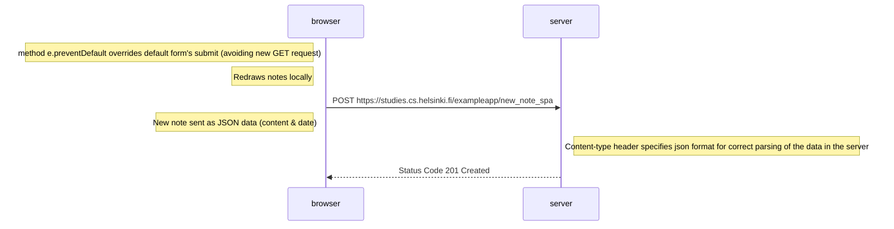

```mermaid
sequenceDiagram
    participant browser
    participant server
    
Note left of browser: method e.preventDefault overrides default form's submit (avoiding new GET request)
Note left of browser: Redraws notes locally
browser->>server: POST https://studies.cs.helsinki.fi/exampleapp/new_note_spa
Note left of browser: New note sent as JSON data (content & date)


Note right of server: Content-type header specifies json format for correct parsing of the data in the server
server-->>browser: Status Code 201 Created
```